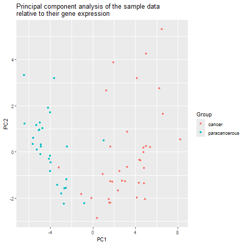
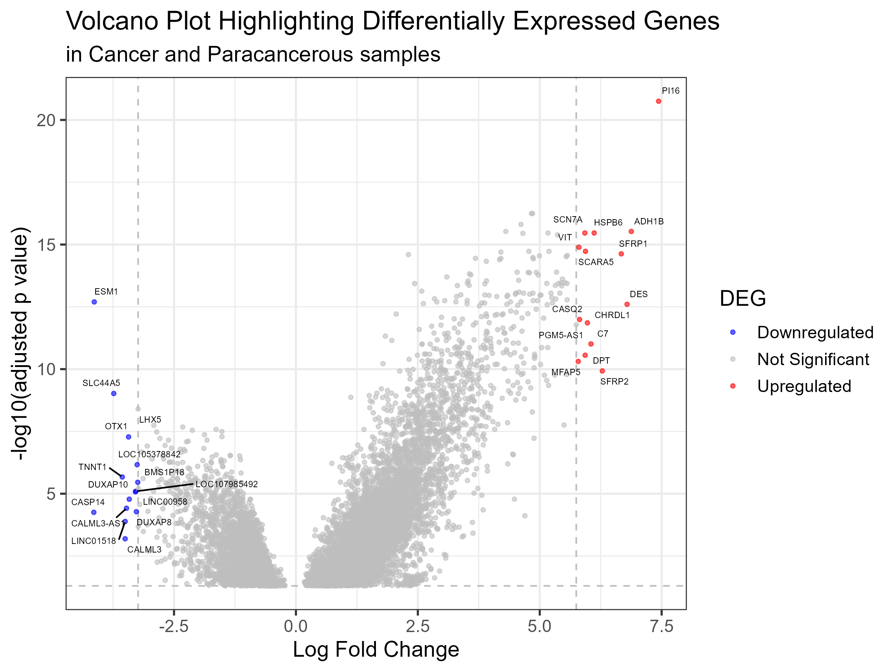
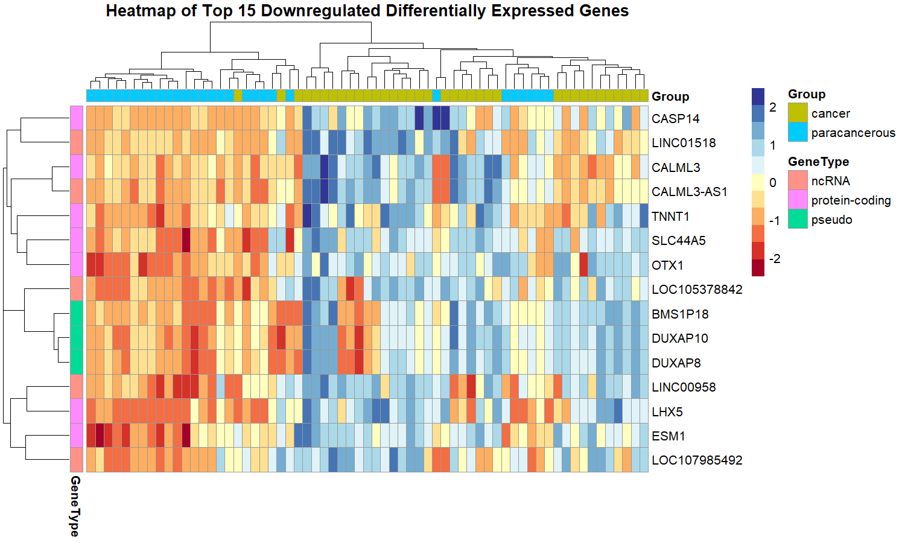
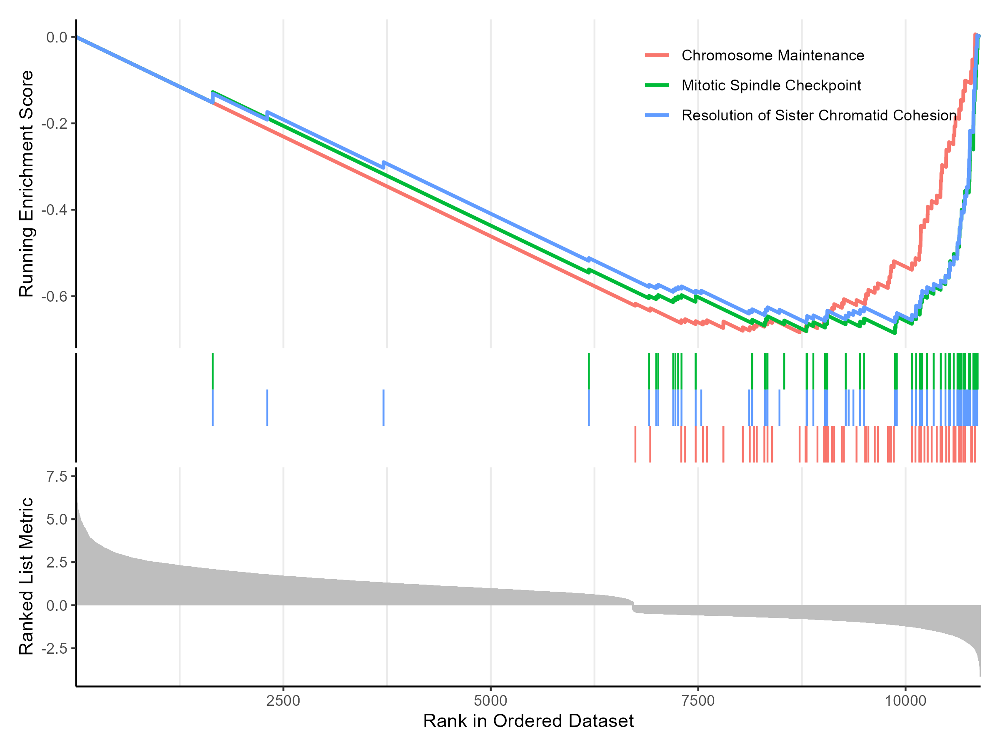
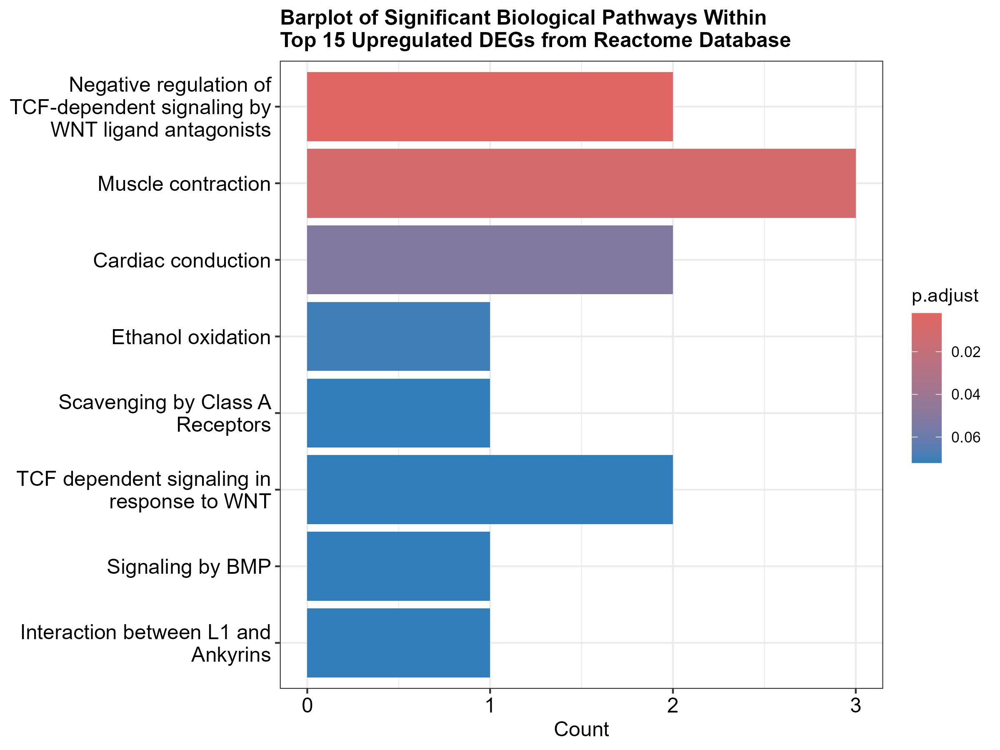

# Differential Expression Analysis of Cancer vs Paracancer Tissues

This project contains the analysis pipeline for identifying differentially expressed genes (DEGs) between cancer and paracancer tissue samples using FPKM RNA-seq data. The analysis was conducted in **R**, primarily using the **limma** package. Outputs include DEG tables, volcano plots, heatmaps, and pathway enrichment analyses.

## 🧪 Overview

- **Data Type**: RNA-seq FPKM data  
- **Comparison**: Cancer vs Paracancer tissue  
- **Goal**: Identify significantly differentially expressed genes and interpret biological significance through pathway enrichment and GSEA

---

## 🔧 Methods

### 1. **Preprocessing**
- Log2 transformation of FPKM values
- Sample quality checks and visualization

### 2. **Differential Expression Analysis**
- Used `limma` with voom transformation
- Designed model matrix to compare cancer vs paracancer groups
- Extracted DEGs based on adjusted p-values and log2 fold changes

### 3. **Visualization**
- **Volcano plots** to display DEGs  
- **Heatmaps** of top differentially expressed genes  
- **PCA plots** to assess sample clustering  

### 4. **Functional Enrichment**
- **GO and Reactome pathway enrichment analysis** using `clusterProfiler`
- **GSEA (Gene Set Enrichment Analysis)** to identify up/downregulated pathways

---

## 📁 Files in this Repository

- `scripts/`: R scripts for each step (preprocessing, limma, plots, enrichment)
- `figures/`: Output figures
- `CancerAndParacancer.RData`: fpkm data and metadata
- `README.md`: This file

---

## 📊 Tools & Packages

| Category | Tools |
|---------|-------|
| Differential Expression | `limma`, `edgeR`, `voom` |
| Visualization | `ggplot2`, `Pheatmap`, `ggrepel` |
| Enrichment | `clusterProfiler`, `ReactomePA`, `enrichplot`, `GSEA` |

---

##🧪   Results

**PCA**

**Volcano Plot**

**Heatmap of Top DEGs Upregulated in Paracancer Tissue**

**Heatmap of Top DEGs Downregulated in Paracancer Tissue**

**GSEA Plot**

**Enriched Upregulated Pathways**

